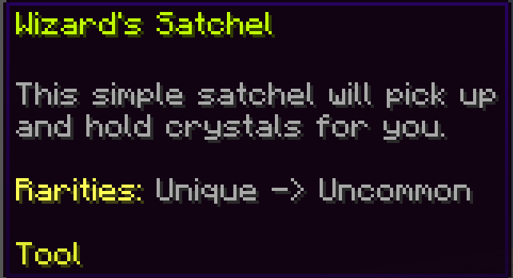

# Theme

### Creating a Theme

A Theme in SefiLib is a way to pre-define a style and reuse it in multi locations.&#x20;

It supports basic chat messages and strings, Themed `ItemStack` and Themed `SlimefunItemStack` also.&#x20;

To create a new Theme, first add the import:

```java
import io.github.sefiraat.sefilib.string.Theme;
```

Then you need to choose your `ChatColor` for the theme.

```java
ChatColor chatColor = ChatColor.of("#3295a8");
```

```java
ChatColor chatColor = ChatColor.RED;
```

```java
Color color = new Color(255, 150, 20);
ChatColor chatColor = ChatColor.of(color);
```


Be sure you use `ChatColor` from `net.md_5.bungee.api.ChatColor` not `org.bukkit.ChatColor`


Then you need a `String` that will be the name, lore line and tag for this `Theme`. This string is used in the following ways:

* Added to the final line in the lore of an `ItemStack`
* Prepends any logging message sent via the `Theme`

Then create a new `Theme` using these two arguments.

```java
Theme TRAIT = new Theme(ChatColor.of("#3295a8"), "Trait");
```

I would suggest creating themes as static elements of a utility class, as per the below example:

```java
package dev.sefiraat.slimetinker2.implementation;

import io.github.sefiraat.sefilib.string.Theme;
import net.md_5.bungee.api.ChatColor;

public final class TinkerThemes {

    private TinkerThemes() {
        throw new IllegalStateException("Utility class");
    }

    public static final Theme MAIN = new Theme(ChatColor.of("#8a0e0e"), "SlimeTinker2");
    public static final Theme RESEARCH = new Theme(ChatColor.of("#a60e03"), "Research");
    public static final Theme CRAFTING = new Theme(ChatColor.of("#dbcea9"), "Crafting Material");
    public static final Theme RECIPE_TYPE = new Theme(ChatColor.of("#ffe89c"), "Recipe Type");
    public static final Theme MACHINE = new Theme(ChatColor.of("#3295a8"), "Machine");
    public static final Theme TOOL = new Theme(ChatColor.of("#3295a8"), "Tool");
    public static final Theme PART = new Theme(ChatColor.of("#dbcea9"), "Part");
    public static final Theme TRAIT = new Theme(ChatColor.of("#3295a8"), "Trait");
    public static final Theme MATERIAL = new Theme(ChatColor.of("#dbcea9"), "Material");
    public static final Theme ENCHANTMENT = new Theme(ChatColor.of("#ffe89c"), "Enchantment");
    public static final Theme UPGRADE = new Theme(ChatColor.of("#ea201a"), "Upgrade");
    public static final Theme ADDON = new Theme(ChatColor.of("#8a0e0e"), "Addon");
}
```

### Using your Theme

#### ItemStack

To create an ItemStack with the Theme applied. Simply use the static method `Theme#themedItemStack()` providing the `Material`, the `Theme` to be applied, the Item's name and a `List<String>` for the lore.

```java
ItemStack itemStack = Theme.themedItemStack(
    Material.OAK_LOG,
    Themes.MATERIAL,
    "Testing Name",
    List.of(
        "Hello there",
        "This is some lore"
    )
);
```

The resulting `ItemStack` will have the name you provided using the Theme's color. The lore lines will follow after a single line gap using a the default `Theme#PASSIVE`. After all of the lore lines, there will be one last gap followed by the Theme's lore line using `Theme#CLICK_INFO`

.png>)

#### SlimefunItemStack

A `SlimefunItemStack` is created in almost the same way, requiring an additional argument for the `SlimefunItem` ID as well as the `List<String>` being replaced with a String Array/String var-args

```java
SlimefunItemStack slimefunItemStack = Theme.themedSlimefunItemStack(
    "ADDON_ITEM_ID",
    Material.OAK_LOG,
    Themes.MATERIAL,
    "Testing Name",
    new String[] {
        "Hello there",
        "This is some lore"
    }
);
```

```java
SlimefunItemStack slimefunItemStack = Theme.themedSlimefunItemStack(
    "ADDON_ITEM_ID",
    Material.OAK_LOG,
    Themes.MATERIAL,
    "Testing Name",
    "Hello there",
    "This is some lore"
);
```



#### Theming Strings

